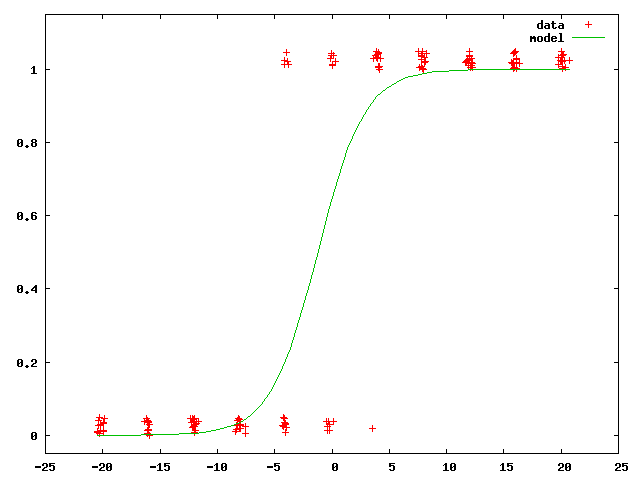

psychometric
============

Estimating Psychometric* Functions in C
---------------------------------------

*[psychometric function](http://en.wikipedia.org/wiki/Psychometric_function)

The program reads in an ascii data file with two columns:

* col 1 = variable (e.g hand position along left-right axis)
* col 2 = binary response (0,1) (e.g. "left" vs "right" sensed hand position)

and fits a binomial model + logit link function using [maximum likelihood estimation](http://en.wikipedia.org/wiki/Maximum_likelihood). A good tutorial on MLE is:

* [Tutorial on maximum likelihood estimation by IJ Myung](http://www.sciencedirect.com/science/article/pii/S0022249602000287)

The model is of the form:

	y = b0 + (b1 * x)
	p(x) = Pr(response|x) = 1 / (1 + exp(-y))

The model parameters b0 and b1 are found that minimize the negative log-likelihood of the data. This is done using numerical optimization. The [Nelder-Mead simplex algorithm](http://en.wikipedia.org/wiki/Nelder–Mead_method) is used here. The code makes use of [Michael Hutt's](http://www.mikehutt.com) implementation of the Nelder-Mead algorithm.

The program outputs:

* the model parameters b0 and b1,
* the bias (the 50th percentile) and
* the acuity (the distance between the 25th and 75th percentile)
* model predictions (x,p(x)) in an output file specified on the command line

an example data file is data.txt

	gcc -Wall -o psychometric psychometric.c nmsimplex.c
	./psychometric data.txt modelpred.txt
	...
	(lots of output)
	...
	The minimum was found at
	1.860482e-01
	1.413820e-01
	72 Function Evaluations
	36 Iterations through program
	min = 70.23225
	
	***************************************************************
	y =  0.18605 + ( 0.14138 * x)
	p(r|x) = 1 / (1 + exp(-y))
	***************************************************************
	bias = -1.31593
	acuity (x75 - x25) = ( 6.45460 - -9.08645) = 15.54105
	***************************************************************
	gnuplot commands to plot result:

	set yrange [-.05:1.15]
	plot 'data.txt' using 1:2 title 'data' with points, \
	     'modelpred.txt' using 1:2 title 'model' with lines
	***************************************************************

An example of the graphic produced by the gnuplot commands for data.txt:

