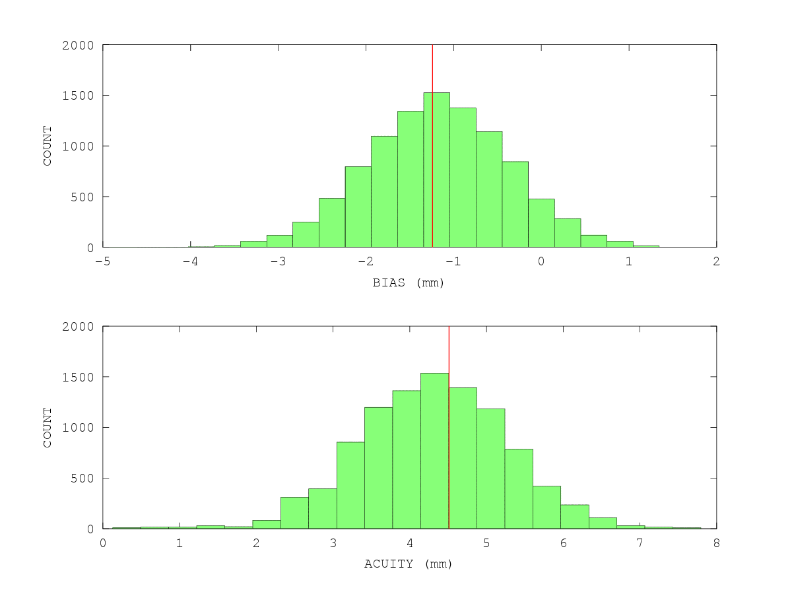

psychometric
============

Estimating Psychometric* Functions in C
---------------------------------------

*[psychometric function](http://en.wikipedia.org/wiki/Psychometric_function)

The program reads in an ascii data file with two columns:

* col 1 = variable (e.g hand position along left-right axis)
* col 2 = binary response (0,1) (e.g. "left" vs "right" sensed hand position)

and fits a binomial model + logit link function using [maximum likelihood estimation](http://en.wikipedia.org/wiki/Maximum_likelihood). A good tutorial on MLE is:

* [Tutorial on maximum likelihood estimation by IJ Myung](http://www.sciencedirect.com/science/article/pii/S0022249602000287)

### The Model

The model is of the form:

	y = b0 + (b1 * x)
	p(x) = Pr(response|x) = 1 / (1 + exp(-y))

The model parameters b0 and b1 are found that minimize the negative log-likelihood of the data. This is done using numerical optimization. The [Nelder-Mead simplex algorithm](http://en.wikipedia.org/wiki/Nelder–Mead_method) is used here. The code makes use of [Michael Hutt's](http://www.mikehutt.com) implementation of the Nelder-Mead algorithm.

### Program Outputs

The program outputs to the screen:

* the model parameters b0 and b1,
* the bias (the x value at the 50th percentile) and
* the slope at the 50th percentile
* the acuity (the distance in x between the 25th and 75th percentile)

The program also generates three output files:

* _params
	* b0, b1, bias, slope, x75, x25, x72-x25
* _pred: p(x) for 50 x points across the range of input x
* _dist: model param distribution based on parametric [bootstrap](http://en.wikipedia.org/wiki/Bootstrapping_(statistics)

### An Example

an example data file is exdata

	gcc -Wall -o psychometric psychometric.c nmsimplex.c
	./psychometric exdata 10000
	found 154 rows of data in exdata
	***************************************************************
	y = 0.60417 + (0.48711 * x)
	p(r|x) = 1 / (1 + exp(-y))
	***************************************************************
	bias = -1.24031
	slope at 50% = 0.12178
	acuity (x75 - x25) = (1.01504 - -3.49566) = 4.51070
	***************************************************************
	gnuplot commands to plot result:
	set yrange [-.05:1.15]
	plot 'exdata' using 1:($2 + (rand(0)/20)) title 'data' with points, \
	     'exdata_pred' using 1:2 title 'model' with lines
	***************************************************************
	simulating 10000 times...
	done

An example of the graphic produced by the [gnuplot](http://www.gnuplot.info) commands for exdata is shown below. Note that the data are offset in y using random values, to help with visualization of the (binary) responses.

You can have a look at the bootstrap distributions of the parameters like so: here I use [GNU Octave](http://www.gnu.org/software/octave/):

	load exdata_dist
	figure
	subplot(2,1,1)
	hist(exdata_dist(:,3),21)
	xlabel('BIAS (mm)')
	ylabel('COUNT')
	load exdata_params
	line([exdata_params(3) exdata_params(3)],get(gca,'ylim'),'color','r','linewidth',2)
	subplot(2,1,2)
	hist(exdata_dist(:,7),21)
	xlabel('ACUITY (mm)')
	ylabel('COUNT')
	line([exdata_params(7) exdata_params(7)],get(gca,'ylim'),'color','r','linewidth',2)
	print exdata_dist.png -dpng

